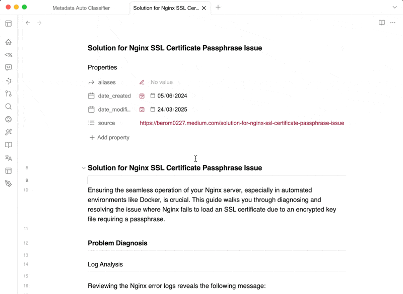
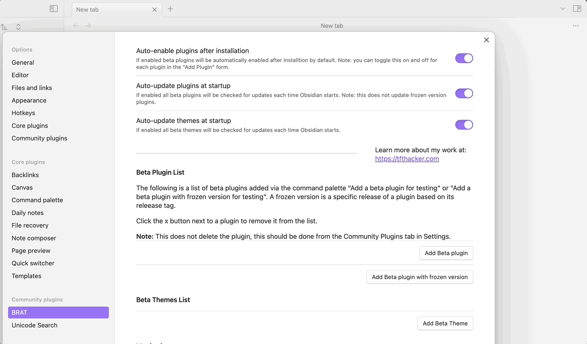

# Metadata Auto Classifier

> The more context you give, the more accurate the classification

Metadata Auto Classifier transforms how you organize your Obsidian vault by intelligently analyzing note content and automatically generating relevant tags and frontmatter. It analyses your notes and generates context-aware tags and frontmatter.

## Example

1. Open any note you want to classify
2. Access commands via Command Palette (Cmd/Ctrl + P):
   - **"Fetch tags using current provider"** - Generate relevant tags
   - **"Fetch all frontmatter using current provider"** - Populate all custom frontmatter fields
   - **Individual field commands** - Update specific frontmatter fields
3. Review and refine AI-generated suggestions as needed
4. Test and validate results using built-in testing tools

## Features

- **Automatically Tag Metadata**: AI-powered analysis generates contextually relevant tags and populates custom frontmatter fields
- **Set Your Classification Rules**: Define custom rules, tag categories, and frontmatter fields tailored to your workflow
- **Give Further Context Per Metadata**: Provide field-specific guidelines and custom prompts for accurate metadata generation
- **Test Model Performance**: Built-in testing tools with preview mode and quality assessment capabilities
- **Flexible Provider & Model Support**: Add and configure custom AI providers and models freely

## Installation

### Community Plugin (Recommended)

1. Open Obsidian and navigate to Settings > Community Plugins
2. Disable Safe Mode if currently enabled
3. Click "Browse" and search for "Metadata Auto Classifier"
4. Click "Install", then "Enable" to activate the plugin

### Manual Installation (Beta)

To install the beta version using BRAT (Beta Reviewers Auto-update Tool):

1. Install BRAT from the Obsidian Community Plugins browser
2. In BRAT settings, click "Add Beta plugin"
3. Enter the repository URL: `https://github.com/beromkoh/obsidian-metadata-auto-classifier`
4. Click "Add Plugin" to install

## Inspiration

The user interface design draws inspiration from [Obsidian Web Clipper](https://obsidian.md/clipper).

## Support

For questions, issues, or feature requests, please visit our [GitHub repository](https://github.com/beromkoh/obsidian-metadata-auto-classifier). We're committed to continuously improving this plugin for the Obsidian community.

## License

This project is licensed under the [MIT License](LICENSE).
