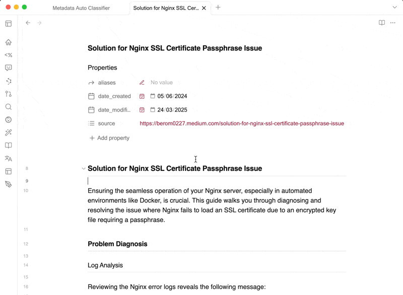
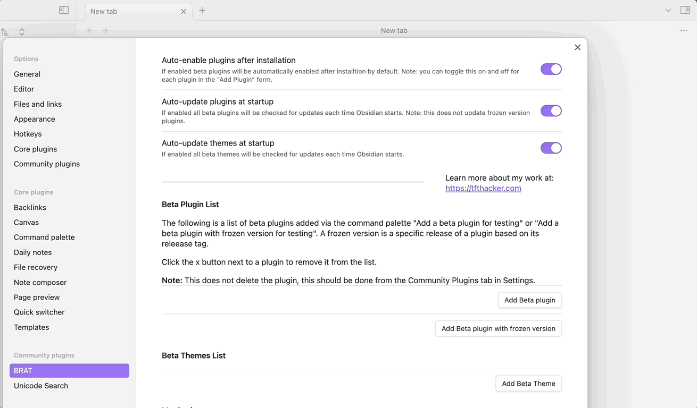

# Metadata Auto Classifier

AI-powered metadata classification for Obsidian. Analyzes your notes and automatically generates context-aware tags and frontmatter using configurable AI providers.

> The more context you give, the more accurate the classification.

## Example


## Features

- **Automatic tag generation** -- AI analyzes note content and generates contextually relevant tags
- **Custom frontmatter fields** -- define any frontmatter fields and let AI populate them automatically
- **Classification rules** -- set custom rules, tag categories, and field-specific guidelines for accurate metadata
- **Per-field context prompts** -- provide additional context per metadata field to guide AI classification
- **Test and preview** -- built-in testing tools with preview mode and quality assessment before applying changes
- **Multi-provider support** -- works with OpenAI, Gemini, Ollama, and other AI providers via a unified interface
- **Custom model configuration** -- add and configure custom AI providers and models freely

## Installation

### Community Plugin (Recommended)

1. Open Obsidian and navigate to **Settings > Community Plugins**
2. Disable Safe Mode if currently enabled
3. Click **Browse** and search for "Metadata Auto Classifier"
4. Click **Install**, then **Enable** to activate the plugin

### Manual Installation (Beta)

Using [BRAT](https://github.com/TfTHacker/obsidian42-brat):

1. Install BRAT from the Obsidian Community Plugins browser
2. In BRAT settings, click **Add Beta plugin**
3. Enter the repository URL: `https://github.com/GoBeromsu/Metadata-Auto-Classifier`
4. Click **Add Plugin** to install



## Usage

1. Open any note you want to classify
2. Access commands via the Command Palette (Cmd/Ctrl + P):
   - **Fetch tags using current provider** -- generate relevant tags
   - **Fetch all frontmatter using current provider** -- populate all custom frontmatter fields
   - **Individual field commands** -- update specific frontmatter fields one at a time
3. Review and refine AI-generated suggestions as needed

## Commands

| Command | Description |
|---------|-------------|
| Fetch tags using current provider | Generate tags for the active note |
| Fetch all frontmatter using current provider | Populate all configured frontmatter fields |
| Fetch [field] using current provider | Update a specific frontmatter field |

## Settings

| Setting | Description |
|---------|-------------|
| AI Provider | Select from OpenAI, Gemini, Ollama, or custom providers |
| Model | Choose or configure the model used for classification |
| Custom frontmatter fields | Define which frontmatter fields AI should generate |
| Classification rules | Set rules and categories for how tags/fields are generated |
| Field-specific prompts | Provide per-field context to guide AI output |

## Tech Stack

| Category | Technology |
|----------|------------|
| Platform | Obsidian Plugin API |
| Language | TypeScript 5 |
| Bundler | esbuild |
| AI | OpenAI, Gemini, Ollama, custom providers |
| Testing | Vitest (with coverage) |
| Linting | ESLint 9 (flat config) + Prettier + eslint-plugin-boundaries |

## Project Structure

```
Metadata-Auto-Classifier/
├── src/
│   ├── main.ts           # Plugin entry point (AutoClassifierPlugin)
│   ├── provider/          # AI provider layer (HTTP, OAuth, prompt generation)
│   ├── classifier/        # Business logic (ClassificationService, CommandService)
│   ├── settings/          # Settings UI (tabs, modals, components)
│   └── lib/               # Pure utilities (frontmatter, sanitizer, ErrorHandler)
├── __tests__/             # Vitest tests (mirrors src/ structure)
├── __mocks__/             # Obsidian API mock
├── scripts/               # dev.mjs, version.mjs, release.mjs
├── boiler.config.mjs      # Per-repo config
└── manifest.json          # Obsidian plugin manifest
```

## Development

```bash
pnpm install
pnpm dev              # vault selection + esbuild watch + hot reload
pnpm build            # tsc type-check + production build
pnpm test             # Vitest unit tests
pnpm test:coverage    # Vitest with coverage report
pnpm lint             # ESLint
pnpm run ci           # build + lint + test
```

## Inspiration

- UI design inspired by [Obsidian Web Clipper](https://obsidian.md/clipper)
- Codex API integration inspired by [Smart Composer](https://github.com/glowingjade/obsidian-smart-composer)

## Support

For questions, issues, or feature requests, please visit the [GitHub repository](https://github.com/GoBeromsu/Metadata-Auto-Classifier).

## License

This project is licensed under the [MIT License](LICENSE).
