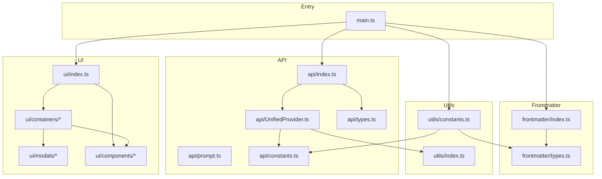

# Architecture

## Grand Principles

These non-negotiable principles guide every architectural and implementation decision.

### 1. Functional Core, Imperative Shell

> **Pure logic at the center. Side effects at the edges.**

```
┌─────────────────────────────────────────────────────────────┐
│                    IMPERATIVE SHELL                         │
│                                                             │
│   • Obsidian API calls                                     │
│   • File I/O                                               │
│   • Network requests                                       │
│   • User notifications                                     │
│                                                             │
│  ┌─────────────────────────────────────────────────────┐   │
│  │                 FUNCTIONAL CORE                      │   │
│  │                                                      │   │
│  │   • Pure functions: f(input) → output               │   │
│  │   • No side effects                                 │   │
│  │   • No hidden state mutations                       │   │
│  │   • Deterministic: same input → same output         │   │
│  │   • Trivially testable                              │   │
│  │                                                      │   │
│  └─────────────────────────────────────────────────────┘   │
└─────────────────────────────────────────────────────────────┘
```

**Why this matters:**
- Pure functions are easy to test (no mocks needed)
- Bugs are localized (side effects are contained)
- Reasoning about code is simpler

**Where we apply this:**

| Layer | Role |
|-------|------|
| `frontmatter/` | Pure transformations (extract, format, validate) |
| `api/prompt.ts` | Pure string generation |
| `main.ts` | Orchestrates all side effects |
| `ui/` | Imperative (DOM manipulation is inherently side-effectful) |

---

### 2. Functions Own Only Their Return Values

> **Never mutate inputs. Never touch global state. Only modify what you return.**

```typescript
// ❌ FORBIDDEN: Mutating input parameter
function processData(data: Data): void {
  data.processed = true;  // Mutating input!
}

// ✅ REQUIRED: Return new value
function processData(data: Data): Data {
  return { ...data, processed: true };  // New object
}
```

```typescript
// ❌ FORBIDDEN: Hidden state modification
class Processor {
  private cache: Map<string, Result>;

  process(input: string): Result {
    const result = compute(input);
    this.cache.set(input, result);  // Hidden side effect!
    return result;
  }
}

// ✅ REQUIRED: Explicit about what changes
function process(input: string, cache: Map<string, Result>): { result: Result; cache: Map<string, Result> } {
  const result = compute(input);
  const newCache = new Map(cache);
  newCache.set(input, result);
  return { result, cache: newCache };  // Caller sees everything
}
```

**The rule:** If a function needs to "change" something, that something must be in the return type.

---

### 3. Fail Fast, Fail Loud

> **Errors are not optional. They demand immediate attention.**

```typescript
// ❌ FORBIDDEN: Silent failure
function getProvider(name: string): Provider | undefined {
  return providers.find(p => p.name === name);
  // Caller might forget to check undefined
}

// ✅ REQUIRED: Explicit failure
function getProvider(name: string): Provider {
  const provider = providers.find(p => p.name === name);
  if (!provider) {
    throw new Error(`Provider not found: ${name}`);
  }
  return provider;
}
```

**Error handling rules:**
1. Never swallow exceptions silently
2. Error messages must include context (what failed, with what input)
3. Prefer throwing over returning `null`/`undefined` for exceptional cases
4. Log errors with context before re-throwing

---

### 4. Explicit Over Implicit

> **Make everything visible. No magic. No hidden knowledge.**

| Implicit (Avoid) | Explicit (Prefer) |
|------------------|-------------------|
| `any` type | Defined interfaces |
| `0.2` (magic number) | `MIN_RELIABILITY_THRESHOLD` |
| Default parameter values | Required parameters |
| Implicit type coercion | Explicit type guards |
| `require()` | ES module `import` |
| Mutable shared state | Immutable data + explicit passing |

**Why:** Code is read 10x more than written. Every implicit assumption is a future bug.

---

### 5. Dependency Direction: Inward Only

> **Core logic has zero external dependencies. Adapters wrap the outside world.**

```
┌────────────────────────────────────────────────────────────┐
│                     EXTERNAL WORLD                          │
│   Obsidian API, AI Providers, File System, DOM             │
└────────────────────────────────────────────────────────────┘
                            │
                            ▼
┌────────────────────────────────────────────────────────────┐
│                      ADAPTERS                               │
│   main.ts, UnifiedProvider, UI components                  │
│   (Translate external APIs to internal interfaces)          │
└────────────────────────────────────────────────────────────┘
                            │
                            ▼
┌────────────────────────────────────────────────────────────┐
│                     CORE LOGIC                              │
│   frontmatter/, api/prompt.ts, pure utilities              │
│   (Zero imports from Obsidian, zero network calls)          │
└────────────────────────────────────────────────────────────┘
                            │
                            ▼
┌────────────────────────────────────────────────────────────┐
│                    TYPE DEFINITIONS                         │
│   */types.ts files                                         │
│   (The innermost layer, depended upon by everything)        │
└────────────────────────────────────────────────────────────┘
```

**Practical implication:** You should be able to test `frontmatter/index.ts` without mocking Obsidian.

---

### 6. Single Responsibility, Single Location

> **One concept, one place. DRY is not optional.**

```typescript
// ❌ FORBIDDEN: Same interface in two files
// api/types.ts
export interface Range { min: number; max: number; }

// frontmatter/types.ts
export interface Range { min: number; max: number; }  // Duplicate!

// ✅ REQUIRED: Single source of truth
// types/common.ts
export interface Range { min: number; max: number; }
// Other files import from here
```

**When you find yourself copying code, stop and extract.**

---

## Current Folder Structure

```
src/
├── main.ts                    # Plugin entry point & orchestrator (IMPERATIVE SHELL)
│
├── api/                       # External AI service integration
│   ├── index.ts              # Public API (processAPIRequest, testModel)
│   ├── UnifiedProvider.ts    # Multi-provider adapter
│   ├── prompt.ts             # Prompt template generation (PURE)
│   ├── constants.ts          # API-related constants
│   ├── types.ts              # API type definitions
│   └── providerPreset.json   # Provider configurations
│
├── frontmatter/              # Frontmatter domain logic (FUNCTIONAL CORE)
│   ├── index.ts              # Core functions (insert, extract, getTags)
│   └── types.ts              # Domain type definitions
│
├── ui/                       # User interface layer (IMPERATIVE SHELL)
│   ├── index.ts              # Settings tab & exports
│   ├── types.ts              # UI-specific types
│   │
│   ├── components/           # Reusable UI building blocks
│   │   ├── BaseSettings.ts   # Abstract settings component
│   │   ├── WikiLinkSelector.ts
│   │   └── common/           # Primitive UI elements
│   │       ├── CommonButton.ts
│   │       ├── CommonNotice.ts
│   │       └── CommonSetting.ts
│   │
│   ├── containers/           # Feature-specific UI sections
│   │   ├── Api.ts            # API configuration section
│   │   ├── Frontmatter.ts    # Frontmatter settings section
│   │   └── Tag.ts            # Tag settings section
│   │
│   └── modals/               # Dialog windows
│       ├── FrontmatterEditorModal.ts
│       ├── FrontmatterSelectModal.ts
│       ├── ModelModal.ts
│       ├── ProviderModal.ts
│       └── WikiLinkSuggestModal.ts
│
└── utils/                    # Shared utilities
    ├── index.ts              # Utility functions (generateId, etc.)
    └── constants.ts          # Global constants & defaults
```

---

## Layer Responsibilities

### Entry Point (`main.ts`)

**Role:** Lifecycle management & workflow orchestration

| Method | Responsibility |
|--------|----------------|
| `onload()` | Initialize plugin, register commands |
| `loadSettings()` | Load persisted settings |
| `saveSettings()` | Persist settings to disk |
| `processFrontmatter()` | Orchestrate single classification workflow |
| `processAllFrontmatter()` | Orchestrate batch classification |

**This is the imperative shell.** All side effects (API calls, file writes, notifications) are coordinated here.

### API Layer (`api/`)

**Role:** Adapter between external AI services and internal interfaces

| File | Responsibility | Purity |
|------|----------------|--------|
| `index.ts` | Public interface, HTTP communication | Imperative |
| `UnifiedProvider.ts` | Multi-provider adapter | Imperative |
| `prompt.ts` | Prompt template generation | **Pure** |
| `constants.ts` | Configuration values | Data |
| `types.ts` | Type definitions | Data |

**Key pattern:** UnifiedProvider uses the **Strategy pattern** via spec objects. Provider-specific logic is *data*, not code.

### Frontmatter Layer (`frontmatter/`)

**Role:** Domain logic for frontmatter manipulation

| Function | Purpose | Purity |
|----------|---------|--------|
| `getContentWithoutFrontmatter()` | Extract note body | **Pure** |
| `getTags()` | Collect all vault tags | Imperative (reads metadata) |
| `insertToFrontMatter()` | Update frontmatter | Imperative (writes file) |
| `getFrontmatterSetting()` | Retrieve setting by ID | **Pure** |

**Goal:** Maximize pure functions. Obsidian API access is injected as a parameter, not imported directly.

### UI Layer (`ui/`)

**Role:** User interface rendering and interaction

```
ui/
├── components/     # Stateless, reusable, receive props
├── containers/     # Stateful, feature-specific, connect to plugin
└── modals/         # Self-contained dialogs
```

**Pattern:** Presentation/Container separation
- Components: "How things look"
- Containers: "How things work"

### Utils Layer (`utils/`)

**Role:** Shared utilities with no domain knowledge

| File | Content |
|------|---------|
| `index.ts` | ID generation, provider preset helpers |
| `constants.ts` | Default settings, default configurations |

---

## Data Flow

### Classification Workflow

```
User Command
     │
     ▼
┌─────────────────┐
│    main.ts      │  1. Validate: file exists? provider configured?
│  (Orchestrator) │
└────────┬────────┘
         │
         ▼
┌─────────────────┐
│  frontmatter/   │  2. Extract content (pure transformation)
│                 │     Collect reference values
└────────┬────────┘
         │
         ▼
┌─────────────────┐
│   api/prompt    │  3. Generate prompt (pure string building)
│                 │
└────────┬────────┘
         │
         ▼
┌─────────────────┐
│      api/       │  4. Call AI provider (side effect)
│ UnifiedProvider │     Parse response (with error handling)
└────────┬────────┘
         │
         ▼
┌─────────────────┐
│  frontmatter/   │  5. Insert to frontmatter (side effect)
│                 │
└────────┬────────┘
         │
         ▼
┌─────────────────┐
│  CommonNotice   │  6. Notify user (side effect)
└─────────────────┘
```

---

## Design Patterns

| Pattern | Location | Purpose |
|---------|----------|---------|
| **Adapter** | `UnifiedProvider` | Normalize different API formats to one interface |
| **Strategy** | Provider specs | Swap provider behavior via configuration objects |
| **Template Method** | `BaseSettings` | Shared behavior with customization hooks |
| **Facade** | `api/index.ts` | Simple interface to complex API subsystem |
| **Dependency Injection** | `insertToFrontMatter(processFn, ...)` | Inject Obsidian API for testability |

---

## Architectural Debt & Improvement Areas

### Current Violations of Grand Principles

| Violation | Location | Improvement |
|-----------|----------|-------------|
| Input mutation | `FrontmatterEditorModal` | Clone props, modify clone |
| `any` types | `UnifiedProvider.processApiResponse` | Define response types per provider |
| Magic numbers | ~~`main.ts:133`~~ | ✅ Fixed: `MIN_RELIABILITY_THRESHOLD` |
| Inline styles | Various modals | Extract to CSS |

### Future Improvements

| Improvement | Benefit |
|-------------|---------|
| Result types (`Result<T, E>`) | Type-safe error handling |
| Event-driven architecture | Plugin extensibility |
| Caching layer | Reduced API calls |
| Classification service class | Better separation of concerns |

---

## Dependency Graph



---

## Related Documents

- [Why I Built This Plugin](./Why%20I%20made%20this%20plugin.md) - Motivation and problem statement
- [Best Practice Violations Fix](./best-practice-violations-fix.md) - Code quality improvements
