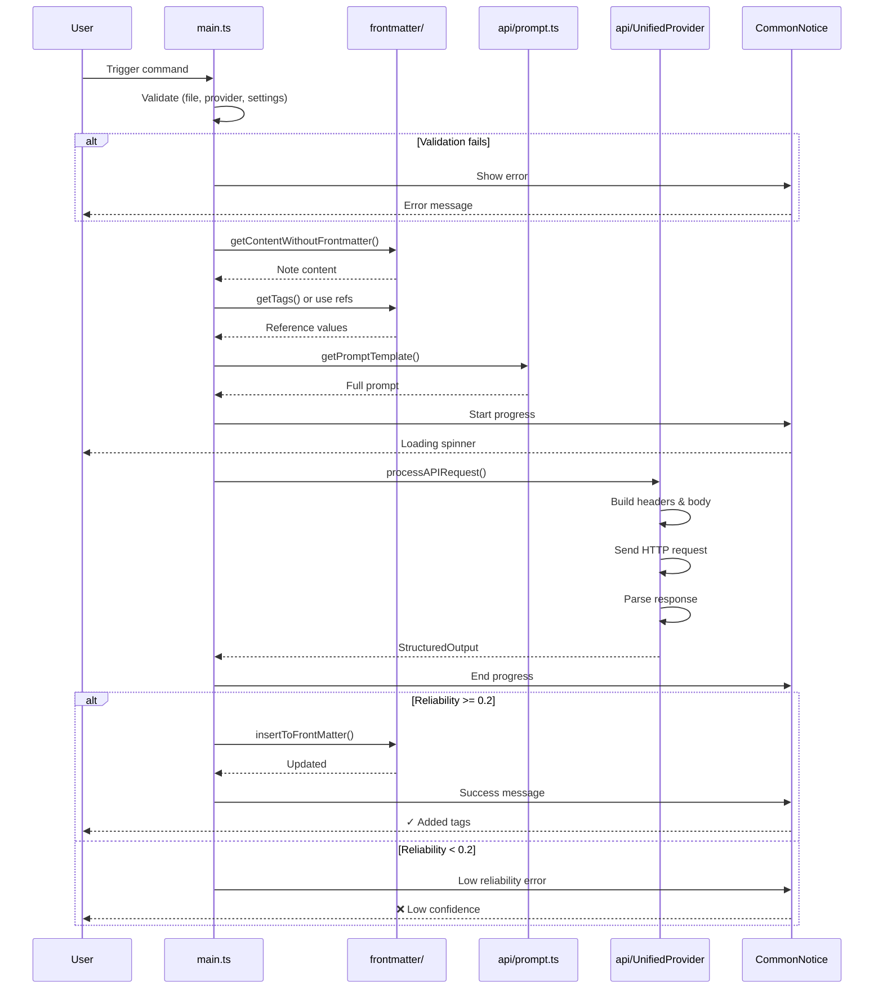

# Classification Workflow

This document explains the step-by-step process when a user triggers metadata classification.

## Overview

```
User triggers command → Validate → Extract content → Build prompt → Call AI → Update frontmatter → Notify
```

**Core pipeline:** Linear, fail-fast, with early exits on validation failures.

---

## Step-by-Step Workflow

### Step 1: Command Trigger

**Entry point:** `main.ts` → `processFrontmatter(frontmatterId)`

```typescript
// User can trigger:
// 1. Specific frontmatter: "Fetch frontmatter: tags"
// 2. All frontmatters: "Fetch all frontmatter using current provider"
```

**What happens:**
1. User selects command from command palette
2. `processFrontmatter(id)` or `processAllFrontmatter()` is called

---

### Step 2: Validation Phase

Three validations must pass before processing:

#### 2.1 Active File Check

```typescript
const currentFile = this.app.workspace.getActiveFile();
if (!currentFile) {
  CommonNotice.error(new Error('No active file.'));
  return;  // ❌ Exit
}
```

**Failure:** No file is open in the editor.

#### 2.2 Provider Check

```typescript
const selectedProvider = this.getSelectedProvider();
if (!selectedProvider) {
  CommonNotice.error(new Error('No provider selected.'));
  return;  // ❌ Exit
}
```

**Failure:** No AI provider configured or selected.

#### 2.3 Frontmatter Setting Check

```typescript
const frontmatter = this.settings.frontmatter.find((fm) => fm.id === frontmatterId);
if (!frontmatter) {
  CommonNotice.error(new Error(`No setting found for frontmatter ID ${frontmatterId}.`));
  return;  // ❌ Exit
}
```

**Failure:** Requested frontmatter setting doesn't exist.

#### 2.4 API Key Check

```typescript
if (!selectedProvider.apiKey) {
  CommonNotice.error(new Error(`API key not configured for provider ${selectedProvider.name}.`));
  return;  // ❌ Exit
}
```

**Failure:** Provider exists but API key is missing.

#### 2.5 Model Check

```typescript
if (!this.settings.selectedModel) {
  CommonNotice.error(new Error(`No model selected.`));
  return;  // ❌ Exit
}
```

**Failure:** No AI model selected.

---

### Step 3: Content Extraction

**Location:** `frontmatter/index.ts` → `getContentWithoutFrontmatter()`

```typescript
const currentContent = await this.app.vault.read(currentFile);
const content = getContentWithoutFrontmatter(currentContent);
```

**What happens:**
1. Read full file content from vault
2. Strip frontmatter section (everything between `---` markers)
3. Return pure note body

**Example:**

```markdown
---
title: My Note
tags: []
---

# Heading

This is the content.
```

**Extracted:** `# Heading\n\nThis is the content.`

---

### Step 4: Reference Collection

**For tags frontmatter:**

```typescript
if (frontmatter.name === 'tags') {
  frontmatter.refs = await getTags(
    this.app.vault.getMarkdownFiles(),
    this.app.metadataCache
  );
}
```

**What happens:**
1. Scan all markdown files in vault
2. Extract all existing tags using Obsidian's metadata cache
3. Deduplicate and return as array

**For custom frontmatter:**

Uses `frontmatter.refs` directly (user-defined reference values).

---

### Step 5: Reference Validation

```typescript
if (processedValues.length === 0) {
  CommonNotice.error(new Error(
    `No reference values found. Please add some reference tags/categories.`
  ));
  return;  // ❌ Exit
}
```

**Failure:** No reference values to classify against.

---

### Step 6: Prompt Generation

**Location:** `api/prompt.ts` → `getPromptTemplate()`

```typescript
const promptTemplate = getPromptTemplate(
  frontmatter.count,      // { min: 1, max: 5 }
  content,                // Note body
  processedValues,        // Reference categories
  frontmatter.customQuery,// User's custom instructions
  classificationRule      // Global classification template
);
```

**Prompt structure:**

```
<task>
Classify the following content using the provided reference categories.
</task>

<instructions>
1. Select only from the reference categories listed.
2. Preserve the exact formatting of the reference categories.
3. Assign a "reliability" score between 0 and 1.
4. Maintain hierarchical structure for nested categories.
</instructions>

<count_instruction>
Limit your selection between {min} and {max} categories.
</count_instruction>

<reference_categories>
{reference values}
</reference_categories>

<content>
{note content}
</content>
```

---

### Step 7: API Call

**Location:** `api/index.ts` → `processAPIRequest()`

```typescript
const apiResponse = await CommonNotice.withProgress(
  currentFile.name,
  frontmatter.name,
  () => processAPIRequest(
    DEFAULT_SYSTEM_ROLE,
    promptTemplate,
    selectedProvider,
    this.settings.selectedModel
  )
);
```

**What happens:**

1. **Progress indicator** shown to user
2. **UnifiedProvider** selects correct provider spec
3. **Headers** built based on provider (Bearer token, x-api-key, etc.)
4. **Request body** constructed with structured output schema
5. **HTTP POST** sent to provider endpoint
6. **Response parsed** according to provider format

**Response format:**

```typescript
interface StructuredOutput {
  output: string[];    // ["tag1", "tag2", "tag3"]
  reliability: number; // 0.85
}
```

---

### Step 8: Reliability Check

```typescript
if (apiResponse && apiResponse.reliability > COMMON_CONSTANTS.MIN_RELIABILITY_THRESHOLD) {
  // Proceed with update
} else if (apiResponse) {
  CommonNotice.error(new Error(
    `Low reliability (${apiResponse.reliability})`
  ));
  // ❌ Exit - don't update frontmatter
}
```

**Threshold:** 0.2 (configurable via `MIN_RELIABILITY_THRESHOLD`)

**Purpose:** Prevent low-confidence classifications from being applied.

---

### Step 9: Frontmatter Update

**Location:** `frontmatter/index.ts` → `insertToFrontMatter()`

```typescript
await insertToFrontMatter(processFrontMatter, {
  file: currentFile,
  name: frontmatter.name,      // "tags"
  value: apiResponse.output,   // ["javascript", "tutorial"]
  overwrite: frontmatter.overwrite,
  linkType: frontmatter.linkType,
});
```

**Logic:**

1. **WikiLink formatting** (if enabled):
   - `"javascript"` → `"[[javascript]]"`

2. **Merge strategy** (based on `overwrite` setting):
   - `overwrite: true` → Replace existing values
   - `overwrite: false` → Append to existing values

3. **Deduplication:**
   - Remove duplicate entries
   - Filter out empty strings

4. **Write to file** via Obsidian's `processFrontMatter` API

---

### Step 10: User Notification

**Success:**

```typescript
CommonNotice.success([
  `✓ ${fileNameWithoutExt} (${frontmatter.name})`,
  `Reliability: ${apiResponse.reliability}`,
  'Added:',
  ...apiResponse.output.map((tag) => `- ${tag}`),
].join('\n'));
```

**Example output:**

```
✓ my-note (tags)
Reliability: 0.87
Added:
- javascript
- tutorial
- web-development
```

---

## Sequence Diagram



---

## Error Handling Summary

| Step | Possible Error | User Message |
|------|---------------|--------------|
| 2.1 | No active file | "No active file." |
| 2.2 | No provider | "No provider selected." |
| 2.3 | No setting | "No setting found for frontmatter ID X." |
| 2.4 | No API key | "API key not configured for provider X." |
| 2.5 | No model | "No model selected." |
| 5 | No references | "No reference values found." |
| 7 | API error | HTTP status + error message |
| 7 | Parse error | "Failed to parse X response: ..." |
| 8 | Low reliability | "Low reliability (0.15)" |

---

## Related Documents

- [Architecture](./Architecture.md) - Overall system design
- [Best Practice Violations Fix](./best-practice-violations-fix.md) - Code quality improvements
